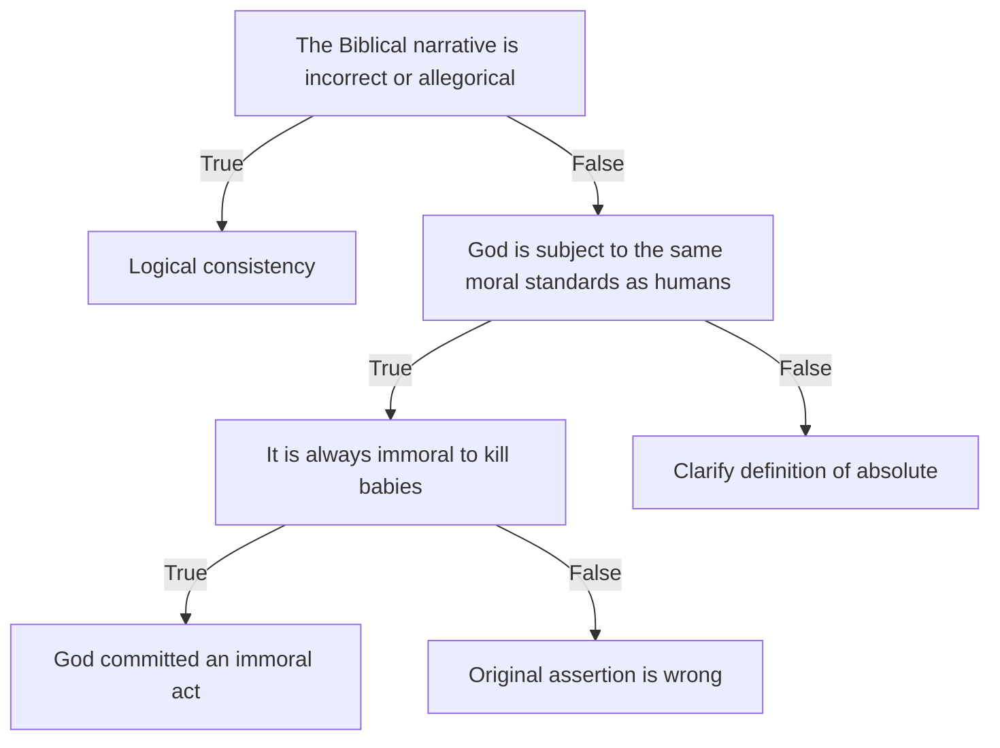

A fellow Twitter user asked this question:

https://twitter.com/MonergismGuy/status/1217909706242609153

He went on to assert this:

https://twitter.com/MonergismGuy/status/1217913219932729345

If I understand his argument correctly, it's something like this:

1. It's always morally wrong to torture babies to death.
2. If you agree with this premise, then moral absolutes exist.
3. If moral absolutes exist, God exists (as mentioned [here](https://twitter.com/MonergismGuy/status/1217913219932729345))

I'm going to skip point 3 for now, because I find it more interesting to ask this question: "If moral absolutes exist, is God subject to them?" Or to put it another way, "what does it mean to say something is a moral absolute?"

### The ten plagues of Egypt

In Exodus, God gives Moses and Aaron orders:

> "And I will harden Pharaoh's heart, and multiply my signs and my wonders in the land of Egypt. But Pharaoh shall not hearken unto you, that I may lay my hand upon Egypt, and bring forth mine armies, and my people the children of Israel, out of the land of Egypt by great judgments." -- [Exodus 7:3-4](https://www.biblegateway.com/passage/?search=Exodus+7&version=KJV)

This has interesting implications for free will. As I read this, God is saying "go talk to the dude, but I am going to make him not listen to you, so people will be impressed with me". If this is the case, everything in the next 3 chapters can be attributed to this motive. The next few chapters reinforce it:

> "And the Lord said unto Moses, Yet will I bring one plague more upon Pharaoh, and upon Egypt; afterwards he will let you go hence: when he shall let you go, he shall surely thrust you out hence altogether." -- [Exodus 11:1](https://www.biblegateway.com/passage/?search=Exodus+11&version=KJV)

What plague?

> "And all the firstborn in the land of Egypt shall die, from the first born of Pharaoh that sitteth upon his throne, even unto the firstborn of the maidservant that is behind the mill; and all the firstborn of beasts. And there shall be a great cry throughout all the land of Egypt, such as there was none like it, nor shall be like it any more." -- [Exodus 11:5-6](https://www.biblegateway.com/passage/?search=Exodus+11&version=KJV)

Every Egyptian child is killed. And prior to that, made to suffer by the other plagues. And for what? To "multiply my signs and my wonders in the land of Egypt".

What was the proposition again? "It is always morally wrong for anyone to torture babies to death merely for their personal pleasure."

### The moral question

The question I was forced to ask, having read all this: "did God commit an immoral act by the definition you offered?"

This is apparently a hard problem, because I got told:

* I can't judge God because I don't believe in him - [here](https://twitter.com/MonergismGuy/status/1217913730425552896)
* If I don't accept absolute morality, it's immoral and hypocritical for me to judge anyone - [here](https://twitter.com/MonergismGuy/status/1217914351253958658)
* If I want to question Biblical morality, I have to answer what basis my morality has - [here](https://twitter.com/MonergismGuy/status/1217926436738207745)
* I think "God is like me" - [here](https://twitter.com/MonergismGuy/status/1217927366158225414)
* It's immoral to accuse God of immoral acts - [here](https://twitter.com/MonergismGuy/status/1217931229552693250)
* I've shown my heart to be wicked like God declares - [here](https://twitter.com/MonergismGuy/status/1217934306296897536)

What I didn't get is a yes-or-no answer to what I feel is a straightforward question. So I offered two other options: the Biblical account is wrong, or it's not always morally wrong to torture babies.

It's important for me to note this: the other option is that my interpretation or reading is wrong! This is _always_ a possibility. However, as this user declined to clarify how that was the case (if it was), and given the generally evasive tone of the other responses, I have to continue to assume I'm reading it right. If any reader disagrees, let me know, and more importantly, let me know how.

I think it's fair to present this question visually, as a series of questions.

Do you think this is a fair representation of the situation? If so, where do you stand on the questions presented here?