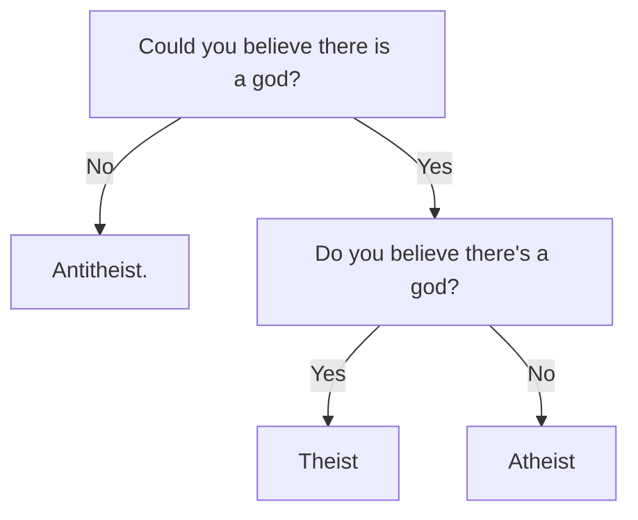

The Stanford Encyclopedia of Philosophy defines [Atheism and Agnosticism] like this:

> in philosophy at least, atheism should be construed as the proposition that God does not exist (or, more broadly, the proposition that there are no gods).

It also presents an alternative:

> "atheism" should be defined as a psychological state: the state of not believing in the existence of God (or gods). 

As for the related term, "agnosticism":

> an agnostic is a person who has entertained the proposition that there is a God but believes neither that it is true nor that it is false.

I am not a philosopher. For purposes of content on this site, I use terms like "atheism", "atheist", "antitheism", etc. in the following sense:

### The horse race

Maybe an analogy is easier?

Suppose that a religious evangelist asks me how I'm betting in a horse race, the Kentucky Religion Derby.

I ask, "who are the horses?" and they answer, "well there's the Christian God, and there's atheism". This version of the Derby is [Pascal's Wager]. There's more horses, of course. Wikipedia has an entire [list of deities], broken into categories. But we can confine ourselves to a few key ones for the purpose of this specific analogy. We'll call them Christianity, Islam, Hinduism, Buddhism, Judaism, and the dark horse, There Is No God.

I ask, "what am I being asked to bet?" The answer is "belief": my time, money, commitment, some space in my mind, a code of behavior, an obligation to worship, and so on. The bet I would have to make is an adherence to the tenets of one of these religions. For Christianity, this is a tenth of my money (tithe) and a seventh of my time ("remember the Sabbath day to keep it holy"), for example. Commitment levels vary. Positive belief that there is no God places no further demands on my time, but it's still a position I've adopted.

If I'm being asked for all this, what am I getting in return? Even otherwise-selfless acts can provide feelings of gratification, so I feel it's okay to ask this question. The evangelist has many answers for this question. If you google "[list of god's promises]", you will find many, many sites listing Bible verses as inspirational devotions, so it's sometimes hard to nail down exactly what's on offer. I picked a site at random, [here](http://www.bible.ca/d-7promises-god.htm), that lists seven:

* He has promised to supply every need we have.
* God has promised that His grace is sufficient for us.
* God has promised that His children will not be overtaken with temptation.
* God has promised us victory over death.
* God has promised that all things work together for good to those who love and serve Him faithfully.
* God has promised that those who believe in Jesus and are baptized for the forgiveness of sins will be saved.
* God has promised His people eternal life.

I'm not going to address these points here, but rather say that this feels to me like a reasonable representation of the Christian views I've personally been exposed to. "Believe in God and you'll live forever"? As a payout, this sounds pretty good!

Now I'm going to ask the evangelist a very important question: "which of these horses have paid off, and how well?"

This is usually where answers differ, and where problems begin.

> Doyle Lonnegan: I put it all on Lucky Dan; half a million dollars to win.  
> Kid Twist: To win? I said *place*! "Place it on Lucky D-" That horse is gonna run second!  
> Doyle Lonnegan: There's been a mistake! Gimme my money back!

In the movie "[The Sting]", two con men cooperate to take on a rich and dangerous mark. They arrange for him to make a bet on a horse race that isn't really happening, then have the authorities apparently bust up the joint to make a clean break of it. As they're the protagonists, this all happens successfully. The guy who made the bet lost his money, the guys who set up the horse race got it, and with luck the mark never sees the cons ever again.

What I'm asking, when I ask about payoff, is this: "is this what's happening to me?" And the only sure way I know of to avoid it is to find out, for sure, that a payoff is even possible. The usual way I would find that out is *evidence*: some kind of repeatable (but not necessarily tangible) test I can perform on the world which gives me an answer in which I'm confident.

Why do I think this is a risk? For starters, some Christians will outright tell me the race is fixed. "These other religions are false," some will say. "You're not worshipping other gods, you're really worshipping Satan and his demons", others claim. Adherents of other horses disagree, of course. And of course, "God is real and is definitely the victor" is the premise of Christian belief. So if we're introducing doubt about what's at stake here, I'm happy to consider the whole thing a risk.

So what is atheism? **It's the position that no horse is a safe bet right now.**

Convincing me to bet is the job of the evangelist. Defending the premise of the bet is the job of the apologist, which we'll go into in another post.

[Atheism and Agnosticism]: https://plato.stanford.edu/entries/atheism-agnosticism/
[Pascal's Wager]: https://plato.stanford.edu/entries/pascal-wager/
[list of deities]: https://en.wikipedia.org/wiki/Lists_of_deities
[list of god's promises]: https://lmgtfy.com/?q=list+of+god%27s+promises
[The Sting]: https://www.imdb.com/title/tt0070735/reference